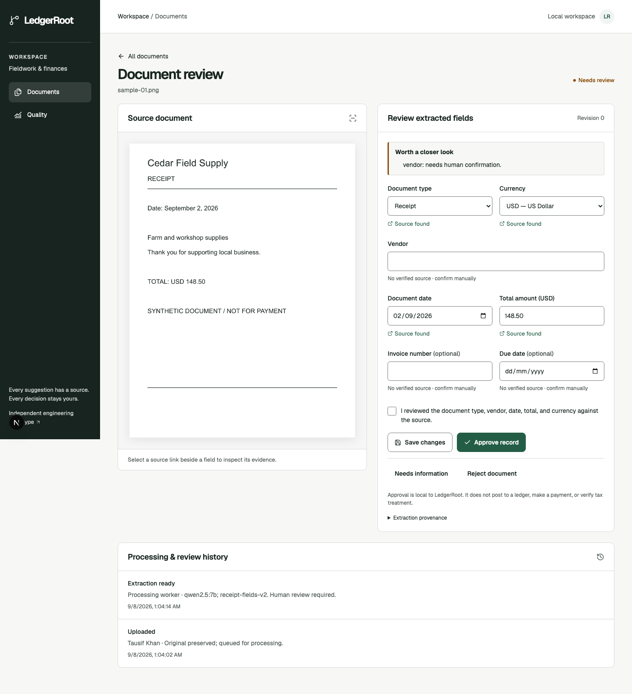

# LedgerRoot

**Receipt and invoice images → evidence-linked suggestions → accountable human review.**

An independent engineering prototype for reliable document processing. Not an Ambrook integration, a verified missing Ambrook feature, or production accounting software. Approval never posts a ledger entry, pays a bill, or verifies tax treatment.



## What works

- Private, validated JPEG/PNG upload, originals preserved, SHA-256 duplicate detection scoped to a workspace.
- PostgreSQL-backed processing state, durable dispatch outbox, BullMQ workers, bounded retries, expired-worker fencing, and retained attempts.
- Local Tesseract OCR + Ollama extraction, checked source references, empty unsupported fields, image-region evidence.
- Human edits, explicit approval, rejection/needs-information reasons, reopen, conflict-safe revisions, and append-only application history.
- Five-file batch UI, per-file byte progress, responsive review, keyboard navigation, accessible dialogs, small thumbnails, pagination.
- Separate sample adapter using six synthetic documents with **recorded real-model results**. Edits stay in this tab; simulated failures/retries are labelled. No arbitrary public uploads or inference calls.
- A 30-case synthetic evaluation, including errors and abstentions—not a production benchmark.

## Try it locally

Prerequisite: **Node 24 and npm 11**. One workspace lockfile is committed. No model or database is needed for sample mode.

```sh
npm ci
npm run db:generate
npm run dev
```

Open **http://localhost:3100/documents**. Select a sample, inspect a source link, correct a field, save, confirm and approve. Reset restores recorded output. Only synthetic data is bundled.

For the real pipeline, install Docker and a local Ollama runtime, then:

```sh
npm run setup:local
npm run infra:up
npm run db:deploy
npm run seed
ollama pull qwen2.5:7b
npm run eval:import
npm run dev:live
```

Open **http://localhost:3100/login**. Local credentials are in the generated, gitignored `.env`; do not share it. Stop the sample server before using `dev:live` on the same port. The real API binds to loopback; Docker ports also bind to loopback. Initial OCR use downloads English trained data to `.cache/ocr`.

See [engineering/setup](docs/engineering.md) for ports, commands, migrations, roles, recovery and deployment.

## Verified evidence

- [Actual local workflow recording](docs/demo/live-workflow.webm) and [machine-readable verification](docs/demo/live-verification.json): upload, real processing, edit surviving refresh, approval and duplicate handling. This is a short un-narrated recording, not a simulated processing animation.
- [Recorded evaluation](apps/web/public/samples/evaluations.json): 30 cases, 116 correct of 118 attempted suggestions, 155 known fields, 2 incorrect suggestions, no predictions into unknown-labelled fields, no terminal extraction errors in this run. Many vendor values were withheld. Read the [evaluation limitations](docs/evaluation.md) before interpreting these numbers.
- Automated local checks include strict types, lint/boundaries, unit rules, database concurrency/recovery, browser review and axe scans. [Verification notes](docs/verification.md) distinguish tested behavior from remaining release work.

Public Vercel publication is **not completed**: the local CLI sign-in token needs renewal. There is no deployed URL to claim yet. [Deployment instructions](docs/deployment.md).

## Architecture

```text
Next.js / React ── Express API ── private S3-compatible storage
                       │            original + derived artifacts
                    PostgreSQL
             documents / runs / revisions / outbox
                       │
                 dispatcher ── Redis / BullMQ ── worker
                                                  │
                                     Sharp → Tesseract → Ollama
```

TypeScript strict · Node 24 · Next 16 / React 19 · Tailwind 4 / Radix · React Hook Form / Zod / TanStack Query · Express 5 · PostgreSQL 17 / Prisma · BullMQ / Redis · S3 SDK · Better Auth · Pino.

The UI primitives follow the small, local Radix/CVA component pattern used by shadcn-style applications; this project does not claim that an external design-skill audit has run.

## Documentation

- [PRD and scope](docs/PRD.md)
- [Architecture and invariants](docs/architecture.md)
- [UI/UX specification](docs/ui-ux.md)
- [Engineering guide](docs/engineering.md)
- [Evaluation and reproducibility](docs/evaluation.md)
- [Evidence and reference boundaries](docs/evidence.md)
- [Prioritized backlog](docs/backlog.md)
- [Architecture decisions](docs/decisions.md)
- [Founder walkthrough](docs/walkthrough.md)

## Important limits

English, USD, JPEG/PNG only; one purchase document per image, 10 MiB / 24 MP. No PDF, HEIC, multipage, bank links, ledger, payments, automatic approval, fuzzy matching, email ingestion or offline sync. This is not a secure production hosting blueprint. Real customer demand, Ambrook's internal implementation, production extraction performance and production operational readiness are unverified.

MinIO is a separate local S3-compatible service, not copied proprietary AIStor source. Review its AGPL/commercial licensing obligations for your intended deployment. An AIStor license is not included or assumed transferable. Reference repositories are untouched.
